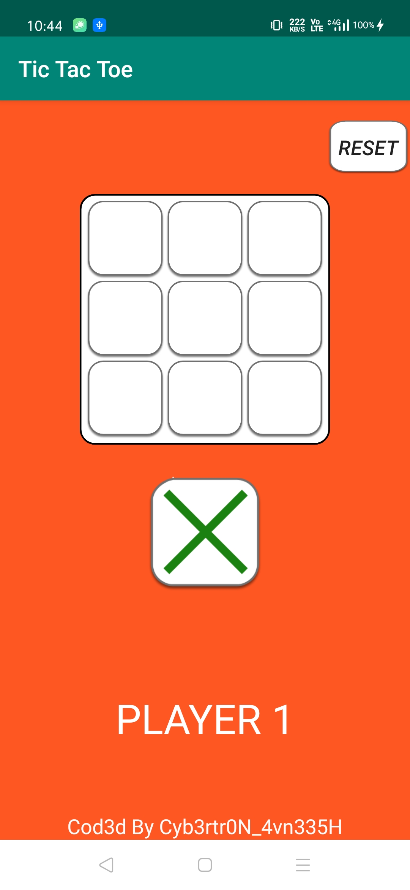
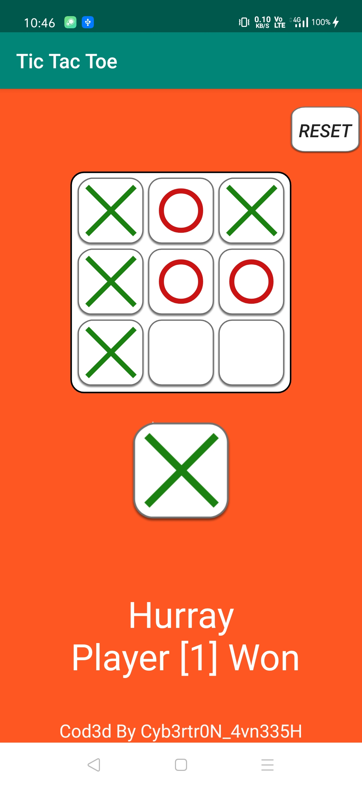
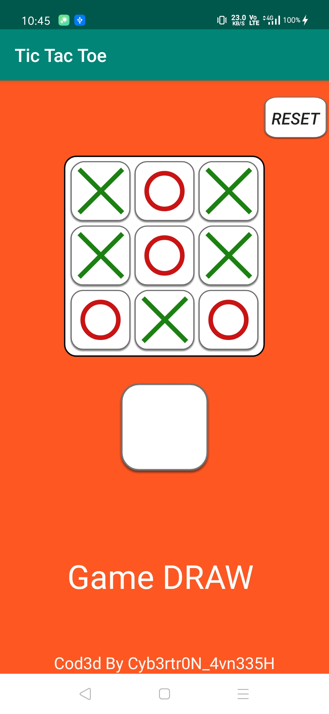
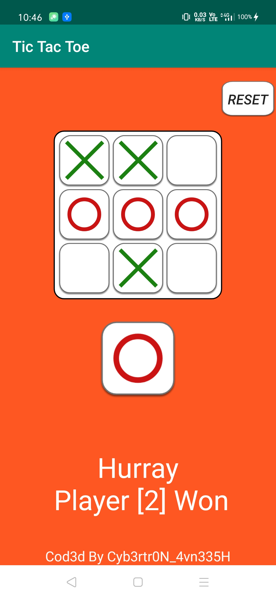

# Tic-Tac-Toe
I created this game in my initial stages of learning AppD.

* Get this app [here](https://github.com/Cybertron-Avneesh/Tic-Tac-Toe/raw/master/app-release.apk)

## Screenshots
|Before Starting Game|Player 1 Won|
|:---:|:---:|
|||
|Game Draw|Player 2 Won|
|||

## Extra
* I used Adobe XD to create buttons and icons.
* Feel free to report bugs.
